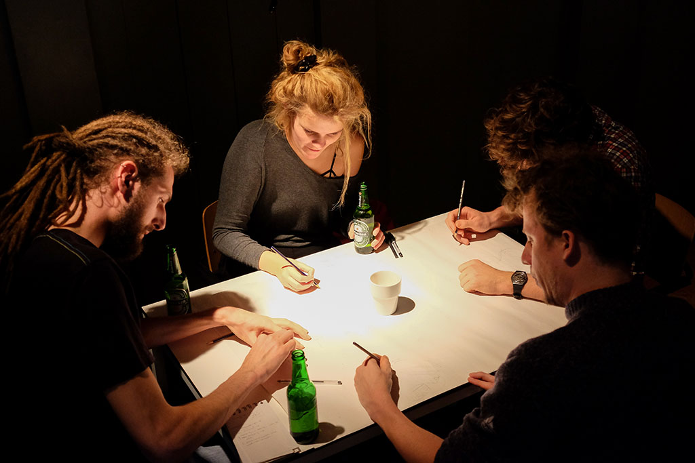
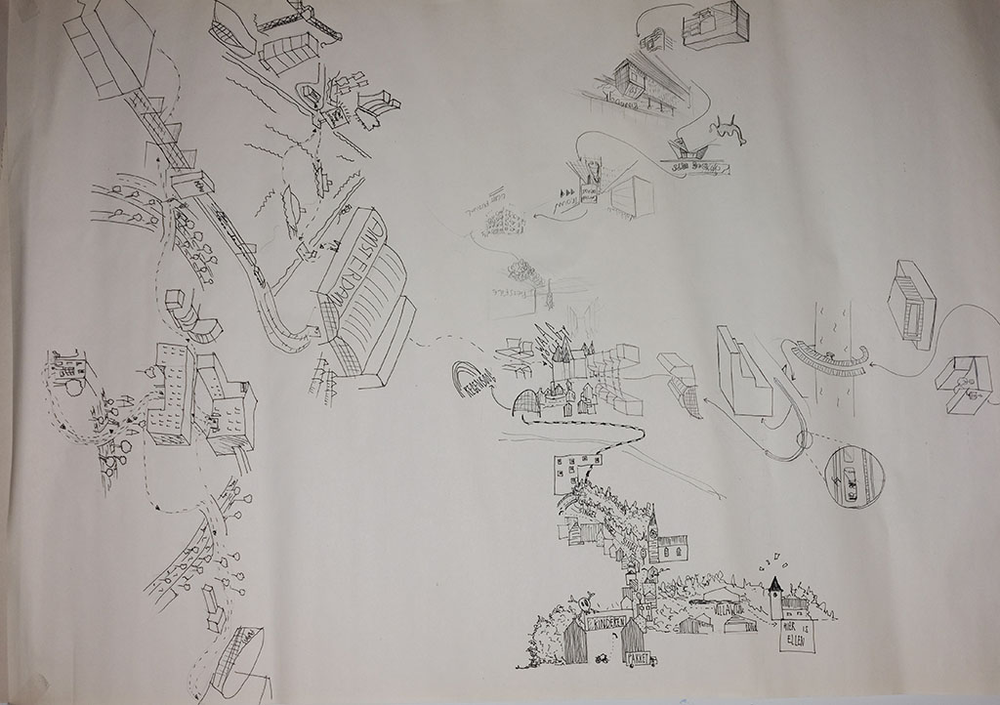
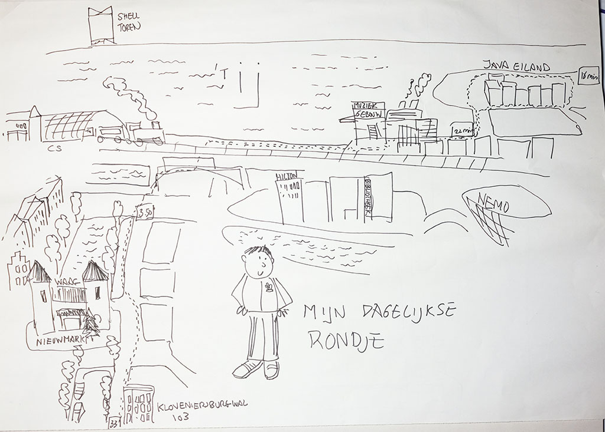

There are two ways to make a map: with data, algorithms and a computer, or by hand, with paper and a pencil. During the second edition of [Maptime Amsterdam](http://maptime-ams.github.io/), the monthly map hack night hosted by Waag Society, we did both!

Last Wednesday night, Maptime started with Utrecht University professor [Marc van Kreveld](http://www.staff.science.uu.nl/~kreve101/) telling about time-space maps that show travel time from a specific starting point. Such maps — maps that depict a thematic variable such as travel time, population density or gross national product instead of geographical distances and land area — are called [_cartograms_](http://en.wikipedia.org/wiki/Cartogram), and they come in all [sorts](http://wwwf.imperial.ac.uk/~mgastner/cartogram/cartogram.html), [colors](http://www.nytimes.com/interactive/2008/04/13/us/20080412_CATHOLIC_GRAPHIC.html?_r=0) and [shapes](http://www.davidrumsey.com/luna/servlet/s/j6g6i0). Most of those cartograms, often used in atlases and news papers, are still drawn by hand, but there is ongoing research on automating the creation of cartograms and time-space maps specifically. This is no easy task, as Marc van Kreveld told us, and you need [geometric algorithms](http://en.wikipedia.org/wiki/Computational_geometry) such as dynamic [Delaunay triangulation](http://bl.ocks.org/mbostock/4341156), as well as [barycentric coordinates](http://en.wikipedia.org/wiki/Barycentric_coordinate_system) to do this. The image below shows the travel time by train from the city of Zwolle to all other train stations in the Netherlands, from the presentation of Marc van Kreveld. This is just a static image, but with [TimeMaps](http://app.timemaps.nl/map) you can do the same, interactively, from any train station in the Netherlands!

After Marc van Kreveld's talk, it was time to directly forget all newly learned mathematics and computer science and return to old-fashioned hand-drawn maps instead. This time, Maptime focused on _one-dimensional maps_, maps that tell a story — in space or time — along a one-dimensional line. This workshop was inspired by [Laurence Penney's](https://twitter.com/lorp) amazing collection of one-dimensional maps, of which you can see some examples on [Rob Keller's blog](http://www.youshouldliketypetoo.com/blog/misc/one-dimensional-maps/). Afterwards, we used [gdal2tiles](http://www.gdal.org/gdal2tiles.html) to create [map tiles](https://www.mapbox.com/guides/how-web-maps-work/) of the photographed workshop results, and [Leaflet](http://leafletjs.com/) to show the maps in a HTML page. Some of the workshop results can be viewed in Maptime Amsterdam's [GitHub repository](https://github.com/maptime-ams/one-dimensional-maps).

