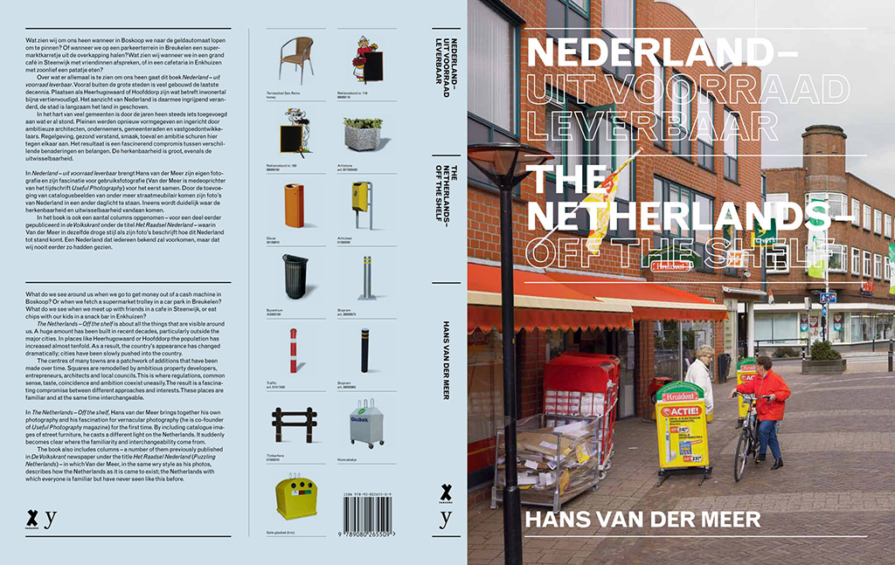
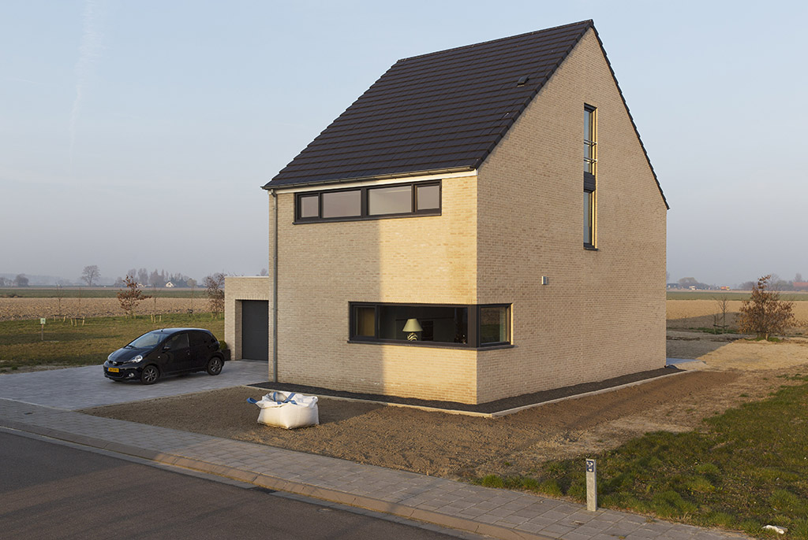
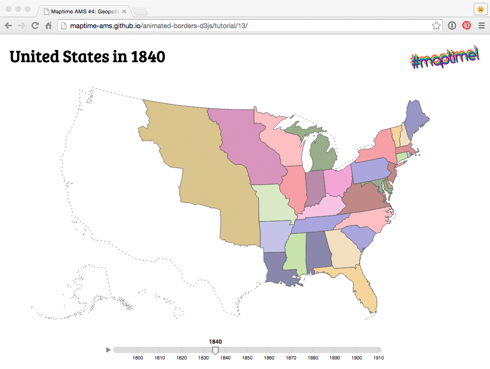

# Maptime #4: Geopolitics & Borders (and D3.js)

A week ago, the fourth edition of [Maptime Amsterdam](http://maptime-ams.github.io/) took place. It was great to see so many people showing up — our Makers Guild room was packed, people were even sitting on the ground and on the tables. Just like the previous editions, a great variety of people attended last week, all with a shared interest in maps and mapmaking: developers, designers, geographers, historians, and, most importantly, both beginners and experts.

[Maptime](http://maptime.io/) is a global initiative on making digital maps and cartography accessible for all levels and degrees of knowledge, and has its roots in San Francisco. Since Maptime Amsterdam started five months ago, many more new [Maptime chapters](http://maptime.io/chapters/) around the world began organizing their first meetups. Together, we're creating a [collection of open learning materials and tutorials](http://maptime.io/lessons-resources/) available for everyone, and we're building a community and learning environment, offering intentional educational support for the beginner. _Maps for all forever_!

Maptime Amsterdam #4 was themed _Geopolitics & Borders_, and started with an inspiring talk by [Henk van Houtum](http://henkvanhoutum.nl/), Professor of Geopolitics and Political Geography of the Radboud University Nijmegen. He told us that since the emergence of the nation state in the 19th century, maps have grown the be almost inherently political: they always show the borders of countries, areas of jurisdiction and administriative regions. But is this really necessary? Shouldn't we use the power of modern cartographic tools to democratize mapmaking, and again make artistic and creative maps ourselves, about people instead of politics? On his blog [Compass to Cartopolitics](https://compasstocartopolitics.wordpress.com/) and in the article [Van Atlas naar Hermes](https://compasstocartopolitics.files.wordpress.com/2014/11/vhoutum_geografie2013-6.pdf) (in Dutch), Van Houtum tells more about what he calls 'c/artography', a reintroduction of art in cartography.

After Henk van Houtum's talk, photographer [Hans van der Meer](http://www.hansvandermeer.nl/) showed us why the Netherlands looks like it does, and how differences in architecture and urban planning makes you directly regognize the moment you cross the border. He showed pictures from his project [Hinterland](http://www.hansvandermeer.nl/projects/hinterland) in which he portraied small-town Holland, and
[The Netherlands - Off the shelf](http://www.hansvandermeer.nl/projects/offtheshelf) for which he researched which objects in Dutch streets make Dutch streets Dutch (it's, among others, the _winkelwagenoverkappingen_).

_The Netherlands - Off the shelf_

For his last project [Document Nederland 2014: The Netherlands - Belgium](https://www.rijksmuseum.nl/en/press/press-releases/document-nederland-2014-the-netherlands-belgium), commissioned by the [Rijksmuseum](https://www.rijksmuseum.nl/), he photographed the border area between the Netherlands and Belgium.

_IJzendijke_, from Document Nederland 2014

All Maptime nights are hands-on, and this time, after the two talks, participants worked on making an animated map
showing how the U.S. states changed between 1970 and the beginning of the 20th century, using [open data](https://www.nhgis.org/) and [D3.js](http://d3js.org/). D3.js is a powerful JavaScript data manipulation and visualization library for the browser. D3 is hard to learn for beginners, so I helped them with preparing a [step-by-step tutorial](https://github.com/maptime-ams/animated-borders-d3js/) for some guidance through the process.

