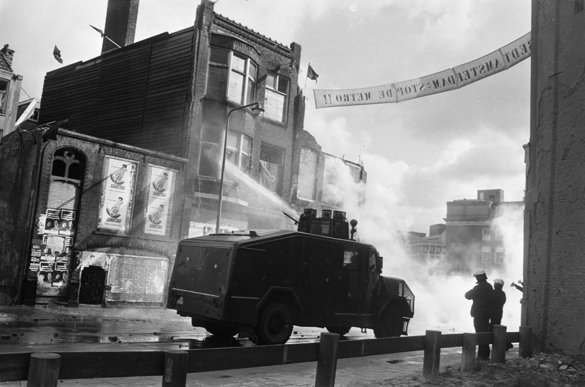

# Time flies when you're making maps

__Join us Wednesday May 20th for the last edition of Maptime Amsterdam before we go on our summer break. Please sign up via Maptime's [Meetup page](http://www.meetup.com/Maptime-AMS/events/220184224/).__

Time flies when you're making maps. Last November, Waag Society's [Maptime chapter](http://maptime-ams.github.io) started with a introduction meeting on digital mapmaking - six months and six meetups later, we've covered a wide range of subjects. We learned about [cartograms and geometric algorithms](https://www.waag.org/en/blog/cartograms-and-one-dimensional-maps), made [hand-drawn one-dimensional maps](https://github.com/maptime-ams/one-dimensional-maps), we designed maps with [Mapbox Studio](https://www.mapbox.com/mapbox-studio/), Henk van Houtum tought us what he means with [cartopolitics](https://compasstocartopolitics.wordpress.com/) and Hans van der Meer showed why you can immediately tell that you've crossed the [Dutch-Belgian border](https://www.rijksmuseum.nl/en/document-nederland-2014). And during one of the last meetups, we used our Fablab's [laser cutter](http://fablab.waag.org/machine/laser-cutter), OpenStreetMap data and open source geospatial software to make [physical visualizations of street patterns](http://maptime-ams.github.io/street-patterns/).

Wednesday May 20th, it's time for the [last edition of Maptime](http://www.meetup.com/Maptime-AMS/events/220184224/) before the summer (but we'll be back in September). Join us at 18:30, the night starts with a walk around the neighbourhood guided by Cees Holtkamp. He's famous for his confectionery and [cookie recipes](http://www.patisserieholtkamp.nl/nl-NL/bakadviezen-en-recepten/), but he knows everything about the history of Amsterdam, too.

Back in the Waag, Huib Morel and Hubert Kraaijvanger of the former [Actiegroep Nieuwmarkt](http://www.npo.nl/andere-tijden/24-03-2015/VPWON_1236042) will show slides and photos from their archives, and tell about how the neighbourhood changed between 1970 and 1980, the years around the construction of the subway line.

(Peters, Hans / Anefo - Fotocollectie Anefo. Nationaal Archief, Den Haag)

After the slide show, we will design and create a print map of how the neighbourhood looked just before the subway was built. By using old photos, slides and OpenStreetMap data, we will export, modify and style this data with [QGIS](http://www.qgis.org/en/site/) and [Inkscape](https://inkscape.org/en/) (or Adobe Illustrator), and we will learn about map design best-practices.

Programme:

- 18:30 - Maptime starts in the Waag
- 18:45 - Start of guided walking tour
- 19:45 - Back in the Waag for slide show from the archives of Actiegroep Nieuwmarkt
- 20:15 - Workshop map design

__Please note: both the walking tour and the slide show will be in Dutch.__
